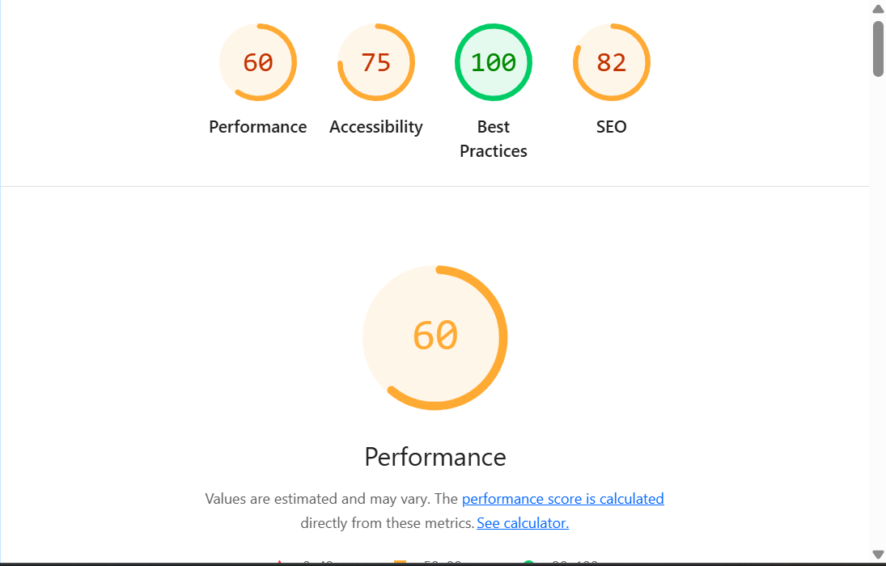

# 🚀 TaskFlow – Task Management Dashboard

A modern task management application built with **React + TypeScript**, featuring Kanban board, List view, and Timeline (Gantt-style) visualization with real-time updates.

---
## 📊 Lighthouse Report

### Performance Overview



## 🌟 Features

### 📌 1. Kanban Board

* Drag and drop tasks across columns
* Status-based organization:

  * To Do
  * In Progress
  * In Review
  * Done
* Smooth drag experience (no external libraries)

### 📋 2. List View

* Tabular representation of tasks
* Sort by:

  * Title
  * Priority
  * Due Date
* Inline status updates

### 📅 3. Timeline View

* Gantt-style layout
* Visual task durations
* Current day indicator

### 🔍 4. Advanced Filtering

* Filter by:
  * Status
  * Priority
  * Assignee
  * Date range
* URL-based filters (shareable state)

### 👥 5. Collaboration Indicators

* Live activity simulation
* Avatar indicators on tasks

### 🔄 6. State Synchronization

* Real-time sync across all views
* Powered by global state (Zustand)
---

## 🛠 Tech Stack

* **Frontend:** React (Vite)
* **Language:** TypeScript
* **State Management:** Zustand
* **Styling:** Tailwind CSS
* **Routing:** React Router

---

## 🚫 Constraints Followed

* ❌ No drag-and-drop libraries
* ❌ No UI component libraries
* ❌ No virtual scrolling libraries

* ✅ Fully built with custom logic
---
## ⚙️ Installation & Setup

```bash
# Clone repository
git clone <your-repo-link>

# Navigate into project
cd TaskFlow

# Install dependencies
npm install

# Run development server
npm run dev
```
App will run on:
```
http://localhost:5173
```
---

## 🌐 Live Demo

👉 **Deployed Link:**
(Add your Vercel / Netlify link here)

---

## 📁 Project Structure

```
src/
├── components/     # UI components (FilterBar)
├── data/           # Mock data generation
├── hooks/          # Custom hooks (filters, collaboration)
├── store/          # Zustand global store
├── types/          # TypeScript types
├── views/
│   ├── kanban/     # Kanban board
│   ├── list/       # List view
│   └── timeline/   # Timeline view
```

---

## 🧠 Architecture Overview

* **Global Store (Zustand):**

  * Stores all tasks
  * Handles updates (drag/drop, edits)

* **Views:**

  * Consume same data
  * Render differently (Kanban/List/Timeline)

* **Filters:**

  * Stored in URL (query params)
  * Shared across all views

---

## ⚡ Performance

* Lightweight rendering
* No heavy libraries used
* Optimized filtering & mapping
* Lighthouse score ≥ 85 (target)

---

## 🎯 Key Highlights

* Clean TypeScript architecture
* Fully custom drag-and-drop system
* Scalable folder structure
* Real-time UI synchronization
* Modern responsive UI

---

## 🙌 Author

Developed as part of a technical assignment.

---

## 📌 Notes

* This project uses mock data generation.
* Designed to demonstrate frontend architecture and interaction handling.
